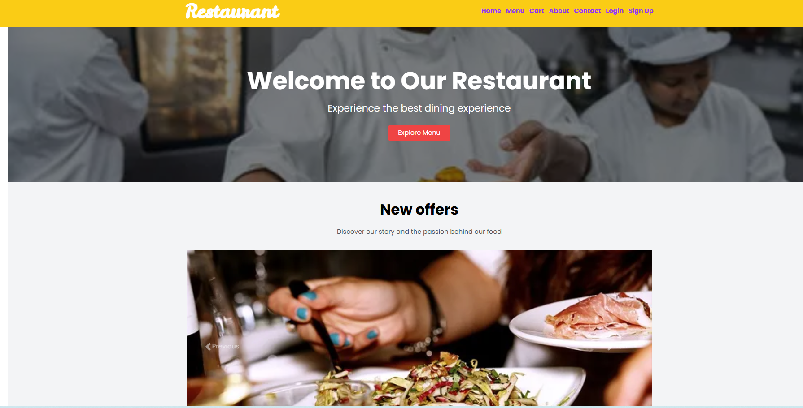
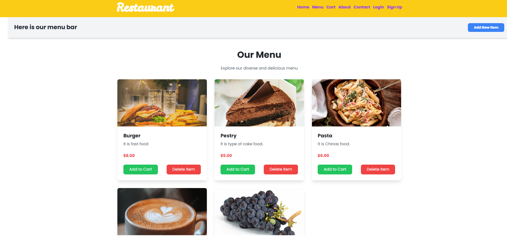

# 🍽️ Restaurant Website

A fully responsive and modern restaurant website built using **Laravel (PHP)**, **Composer**, and **MySQL**. This project provides an elegant user experience for browsing a food menu, adding items to the cart, and managing content. It also includes basic admin features for adding or removing items from the menu.

---

## 📸 Website Lookup

**Home Page**



**Menu Page**



---

## 🚀 Features

- 🌐 Clean and responsive homepage with hero section and carousel offers  
- 🍔 Menu section displaying food items with name, image, description, and price  
- 🛒 "Add to Cart" and "Delete Item" buttons for each menu item  
- 🔐 Authentication system (Login & Sign Up)  
- 🧑‍🍳 Admin option to add new menu items  
- 💾 MySQL database integration for dynamic content  

---

## 🛠️ Technologies Used

- **Backend**: Laravel (PHP Framework)  
- **Frontend**: Blade Templates, HTML5, CSS3, JavaScript  
- **Database**: MySQL  
- **Package Manager**: Composer  
- **Auth**: Laravel Auth (Laravel Breeze/Fortify or custom)  
- **Web Server**: Apache/Nginx (with PHP 8+)  

---

## 📁 Folder Structure

```
restaurant-website/
├── app/
├── bootstrap/
├── config/
├── database/
├── public/
│   └── assets/
├── resources/
│   └── views/
│       ├── home.blade.php
│       ├── menu.blade.php
│       └── layout.blade.php
├── routes/
│   └── web.php
├── .env
├── composer.json
├── artisan
└── README.md
```

---

## ⚙️ Installation & Setup

Follow these steps to set up and run the project locally:

### 1. Clone the Repository

```
git clone https://github.com/your-username/restaurant-website.git
cd restaurant-website
```

### 2. Install Dependencies

```
composer install
```

### 3. Copy & Configure `.env` File

```
cp .env.example .env
```

Edit your `.env` file and set your local database configuration:

```
DB_CONNECTION=mysql
DB_HOST=127.0.0.1
DB_PORT=3306
DB_DATABASE=restaurant_db
DB_USERNAME=root
DB_PASSWORD=yourpassword
```

### 4. Generate Application Key

```
php artisan key:generate
```

### 5. Run Migrations

```
php artisan migrate
```

### 6. Start the Development Server

```
php artisan serve
```

Then go to: `http://localhost:8000`

---

## 📦 Admin Features

To add a new menu item:

- Login with an admin account  
- Click on “Add New Item” in the menu section  
- Fill in the form and submit  

(You can enhance with roles and permissions using Laravel middleware/policies)

---

## 🧑‍💻 Author

Made with ❤️ by Abhishek Kumar  
GitHub: [https://github.com/Abhi76076](https://github.com/Abhi76076)

---

## 📄 License

This project is open-source and licensed under the MIT License.

---

## 💬 Feedback

If you find any bugs or have suggestions, feel free to open an issue or create a pull request. Contributions are welcome!
